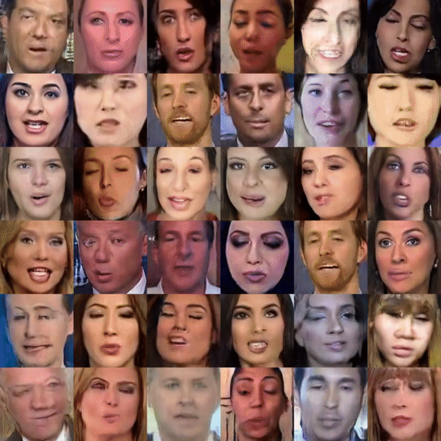
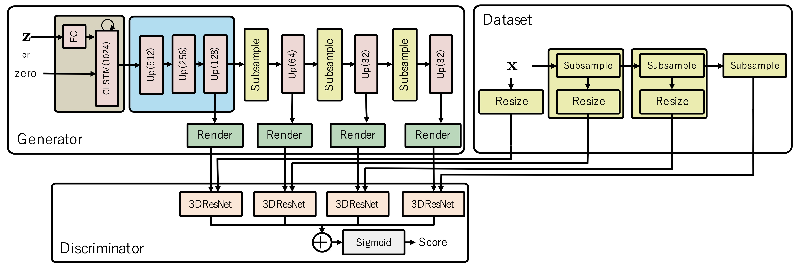

# Temporal Generative Adversarial Nets v2



This repository contains the implementation of TGANv2 and scripts to reproduce experiments in the paper.



## Requirements

- docker
- nvidia-docker
- unrar

### Tested environment

Ubuntu 18.04 w/

- 4 x V100 (32GB) GPUs for UCF101 experiments
- 8 x V100/P100 (16GB) GPUs for FaceForensics experiments

## Setup the environment with Docker

```bash
cd docker
docker build -t tgan2 .
```

## Prepare datasets

### UCF101

Please run the `download.sh` script as followings.

```bash
bash scripts/download_ucf101.sh
```

It retrieves the UCF101 dataset from the official server and extract all the videos contained in it under `datasets/ucf101` directory which is automatically created by the script.

```
datasets
└── ucf101
    ├── ucfTrainTestlist
    │   ├── classInd.txt
    │   ├── testlist01.txt
    │   ├── testlist02.txt
    │   ├── testlist03.txt
    │   ├── trainlist01.txt
    │   ├── trainlist02.txt
    │   └── trainlist03.txt
    ├── v_ApplyEyeMakeup_g01_c01.avi
    ├── v_ApplyEyeMakeup_g01_c02.avi
    ├── v_ApplyEyeMakeup_g01_c03.avi
    ⋮
    ├── v_YoYo_g25_c03.avi
    ├── v_YoYo_g25_c04.avi
    └── v_YoYo_g25_c05.avi
```

Then, please run the `make_ucf101.py` script to apply preprocessings:

```bash
docker run --rm -v $PWD:/tgan2 -t tgan2 \
bash -c "cd /tgan2 && python3 scripts/make_ucf101.py --img-rows 192 --img-cols 256"
```

### FaceForensics

To download the FaceForensics (v1) dataset, please fill out this form: [FaceForensics, FaceForensics++, and DeepFakes Detection Dataset](https://docs.google.com/forms/d/e/1FAIpQLSdRRR3L5zAv6tQ_CKxmK4W96tAab_pfBu2EKAgQbeDVhmXagg/viewform).
Once the request is accepted, you should be able to get the download script named `faceforensics_download_v1.py` by following the instruction given in an e-mail from the distributor, so please place it under the `scripts` dir.

(You can also find more details in this official [README](https://github.com/ondyari/FaceForensics/blob/master/dataset/README.md) of the FaceForensics dataset.)

Then, please run the following commands to download the FaceForensics dataset.

```bash
python scripts/faceforensics_download_v1.py -d compressed datasets
```

It creates `FaceForensics_compressed` directory automatically under the `datasets` dir:

```
datasets
├── FaceForensics_compressed
│   ├── test
│   │   ├── altered
│   │   │   ├── 0r4uhJdcIQA_1_cpywXpZVP6o_6.avi
│   │   │   ├── 1aJO2VkfZiY_2_EMLALfhSftA_0.avi
│   │   │   ⋮
│   │   ├── mask
│   │   │   ├── 0r4uhJdcIQA_1_cpywXpZVP6o_6.avi
│   │   │   ├── 1aJO2VkfZiY_2_EMLALfhSftA_0.avi
│   │   │   ⋮
│   │   └── original
│   │       ├── 0r4uhJdcIQA_1_cpywXpZVP6o_6.avi
│   │       ├── 1aJO2VkfZiY_2_EMLALfhSftA_0.avi
│   │       ⋮
│   ├── train
│   │   ├── altered
│   │   │   ├── 00JT2rwquIE_1_10r7mRtkE0s_0.avi
│   │   │   ├── 03pM6Vgv8-g_3_Bpa3wwb5Dt8_1.avi
│   │   │   ⋮
│   │   ├── mask
│   │   │   ├── 00JT2rwquIE_1_10r7mRtkE0s_0.avi
│   │   │   ├── 03pM6Vgv8-g_3_Bpa3wwb5Dt8_1.avi
│   │   │   ⋮
│   │   └── original
│   │       ├── 00JT2rwquIE_1_10r7mRtkE0s_0.avi
│   │       ├── 03pM6Vgv8-g_3_Bpa3wwb5Dt8_1.avi
│   │       ⋮
│   └── val
│       ├── altered
│       │   ├── 093EdKDP7Zs_5_8-n1eJ93hLo_1.avi
│       │   ├── 0GvV_83Wlf8_2_aqHwzt9uceI_0.avi
│       │   ⋮
│       ├── mask
│       │   ├── 093EdKDP7Zs_5_8-n1eJ93hLo_1.avi
│       │   ├── 0GvV_83Wlf8_2_aqHwzt9uceI_0.avi
│       │   ⋮
│       └── original
│           ├── 093EdKDP7Zs_5_8-n1eJ93hLo_1.avi
│           ├── 0GvV_83Wlf8_2_aqHwzt9uceI_0.avi
│           ⋮
├── faceforensics_download_v1.py
⋮
```

Finally, please run the following command to create `.h5` files from those downloaded videos:

```bash
docker run --rm -v $PWD:/tgan2 -t tgan2 \
bash -c "cd /tgan2 && python3 scripts/make_face_forensics.py"
```

It generates some `.h5` files and `.json` files under `datasets/face256px` directory like this:

```
datasets
├── face256px
│   ├── test.h5
│   ├── test.json
│   ├── train.h5
│   ├── train.json
│   ├── val.h5
│   └── val.json
⋮
```

## Pre-trained weights

Please download a pre-trained weights for C3D model that is used for calculating the Inception scores.

```bash
cd datasets
if [ ! -d models ]; then mkdir -p models; fi
wget https://github.com/mitmul/tgan2/releases/download/untagged-d2d4900c6c1bb09d9f5a/conv3d_deepnetA_ucf.npz
wget https://github.com/mitmul/tgan2/releases/download/untagged-d2d4900c6c1bb09d9f5a/mean2.npz
```

## Experiments

### Train TGANv2 on the UCF101 dataset

```bash
docker run --rm -v $PWD:/tgan2 -t tgan2 \
bash -c "cd /tgan2 && \
mpiexec -n 4 \
python3 train.py \
conf/dirac.yml \
conf/dset/ucf101_192x256.yml \
conf/gen/tgan_multi_192x256.yml \
conf/dis/resnet_multi.yml \
-a \
'out=results/full-bs-128' \
'batchsize=32' \
'gen.args.n_layers=1' \
'gen.args.clstm_ch=1024' \
'updater.args.n_dis=1' \
'updater.args.lam=0.5' \
'linear_decay.start=0' \
'gen.args.subsample_frame=[2,2,2]' \
'dataset.args.subsample_frame=[2,2,2]' \
'gen.args.subsample_batch=[2,2,2]' \
'updater.args.subsample_batch=[2,2,2]'"
```

### Train TGANv2 on the FaceForensics dataset

```bash
docker run --rm -v $PWD:/tgan2 -t tgan2 \
bash -c "cd /tgan2 && \
mpiexec -n 8 \
python3 train.py \
conf/dirac.yml \
conf/dset/face256px.yml \
conf/gen/tgan_multi_192x256.yml \
conf/dis/resnet_multi.yml \
-a \
'out=results/full-bs-128_faceforensics3' \
'batchsize=16' \
'dataset.args.subsample_frame=[2,2,2]' \
'gen.args.n_layers=1' \
'gen.args.clstm_ch=1024' \
'gen.args.subsample_batch=false' \
'gen.args.subsample_frame=[2,2,2]' \
'gen.args.t_size=4' \
'updater.args.n_dis=1' \
'updater.args.lam=0.5' \
'updater.args.subsample_batch=false' \
'linear_decay.start=0'"
```

## Evaluation

### The inception score on UCF101

```bash
docker run --rm -v $PWD:/tgan2 -t tgan2 \
bash -c "cd /tgan2 && \
python3 scripts/compute_inception_score.py \
results/full-bs-128/config.yml \
-m results/full-bs-128/generator_iter_82000.npz \
-o results/full-bs-128/result.yml"
```

The inception score will be saved in the path given as the `-o` option.

### FID scores

1. Calculate statistics of the UCF101 dataset

```bash
docker run --rm -v $PWD:/tgan2 -t tgan2 \
bash -c "cd /tgan2 && \
python3 scripts/compute_fid.py \
--ucf101-h5path-train datasets/ucf101_192x256/train.h5 \
--ucf101-config-train datasets/ucf101_192x256/train.json \
--c3d-pretrained-model datasets/models/conv3d_deepnetA_ucf.npz \
--stat-output datasets/ucf101_192x256/ucf101_192px_stat.npz"
```

This command saves the resulting statistics of UCF101 (192x192 resolution) to the path given by `--stat-output` option.

2. Calculate the FID score of a given trained model

```bash
docker run --rm -v $PWD:/tgan2 -t tgan2 \
bash -c "cd /tgan2 && \
python3 scripts/compute_fid.py \
--stat-filename datasets/ucf101_192x256/ucf101_192x256_stat.npz \
--config results/full-bs-128/config.yml \
--gen-snapshot results/full-bs-128/generator_iter_82000.npz \
--n-samples 2048 \
--batchsize 32 \
--result-dir results/full-bs-128"
```

`--batchsize 32` comsumes about `13245MiB` of the GPU memory, while `--batchsize 64` requires about `24261MiB` and `--batchsize 80` requries about `32171MiB`. If you run this on a 32 GB V100 GPU, choose 64 or 80 for the batchsize to make the calculation faster.

## Results

Model | UCF101
-- | --
Conv3D (gen: conv3d, dis: conv3d) | 9.53
Conv-ResNet (gen: conv3d, dis: resnet) | 9.74
ResNet3D (gen: resnet, dis: resnet) | 9.62
TGAN ([v1](https://arxiv.org/abs/1611.06624)) | 11.85 +- 0.07
TGANv2 (gen: convLSTM+MultiResNet dis: MultiResNet) | 25.07 +- 0.47

The FID score of TGANv2 on UCF101 is `3457.42 +- 26.81`.

## Citation

Please cite this paper when you use the code in this repository:

```
@journal{TGAN2020,
    author = {Saito, Masaki and Saito, Shunta and Koyama, Masanori and Kobayashi, Sosuke},
    title = {Train Sparsely, Generate Densely: Memory-efficient Unsupervised Training of High-resolution Temporal GAN},
    booktitle = {International Journal of Computer Vision},
    year = {2020},
}
```
